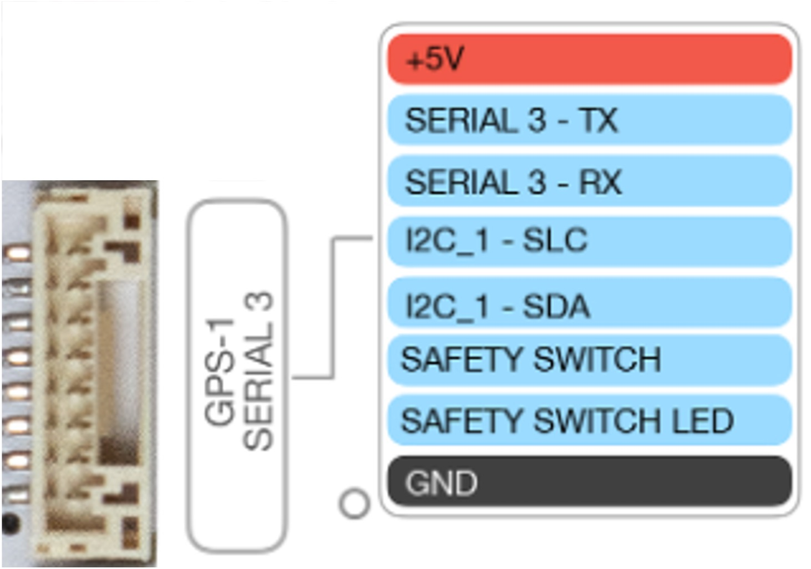
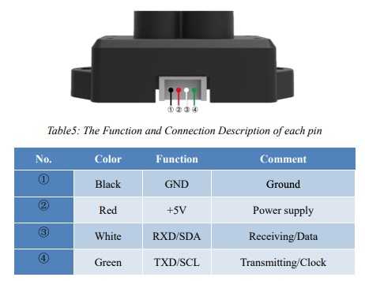

Rangefinder to Cube Serial Cable
=====

.. _cablebuild:

Cable Build
------------

The Benewake TFMini-S rangefinder connector is a 4-pin JST-GH. The port availabe on the Airbot Mini Carrier Board is the 8-pin JST-GH GPS-1/Serial 3. We will build a 3 inch harness beteen these two connections. The pinout for the mini carrier board can be found `here <https://docs.cubepilot.org/user-guides/carrier-boards/airbot-mini-carrier-board/airbot-mini-carrier-board-set-user-guide#rc-signal-and-power-selection>`_. The pinout for the Benewake TFMini-S rangefinder can be found `here <https://cdn.sparkfun.com/assets/8/a/f/a/c/16977-TFMini-S_-_Micro_LiDAR_Module-Product_Manual.pdf>`_ 

The pins on the Serial 3 connector that we need are:

1. +5V
2. Serial_3 - TX
3. Serial_3 - RX
4. (Not needed) I2C1-SLC
5. (Not needed) I2C2-SDA
6. (Not needed) Safety Switch
7. (Not needed) Safety Switch LED
8. GND

The pins on the rangefinder connector that we need are:

1. GND
2. +5V
3. RXD
4. TXD

We have to connect the RX each connector to the TX on the other. The connections should be:

+------------+-------------+
| Serial 3   | RangeFinder |
|            |             |
+============+=============+
| 1. +5V     | 2. +5V      |
+------------+-------------+
| 2. TX      | 3. RX       |
+------------+-------------+
| 3. RX      | 4. TX       |
+------------+-------------+
| 8. GND     | 1. GND      |
+------------+-------------+

